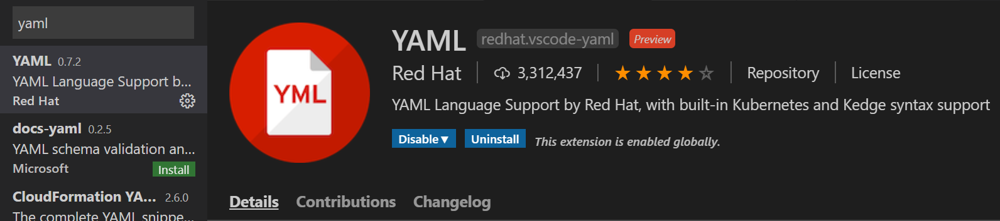
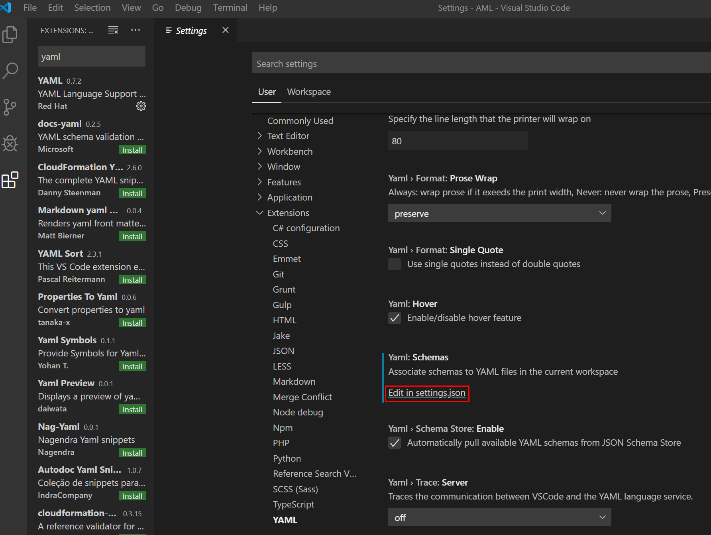
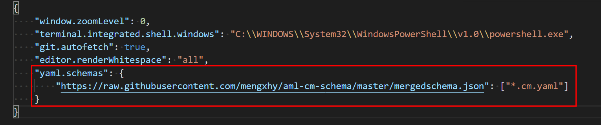

# aml-cm-schema
This is a public repo to share azure machine learning custom module spec schema

## How to enable custom module spec edit/validation in vscode

- Download vscode.

- Download vscode 'YAML' extension

  

- Edit your settings

  

  In **settings.json**, add below section:

  

  Here we configure to apply [custom module schema](https://raw.githubusercontent.com/mengxhy/aml-cm-schema/master/mergedschema.json) to all files that end with ''.cm.yaml". You can change this to build your own mapping.

- Then when you edit a file ends with ".cm.yaml" in your vscode, the auto-complete and auto-validation should be enabled.

  
